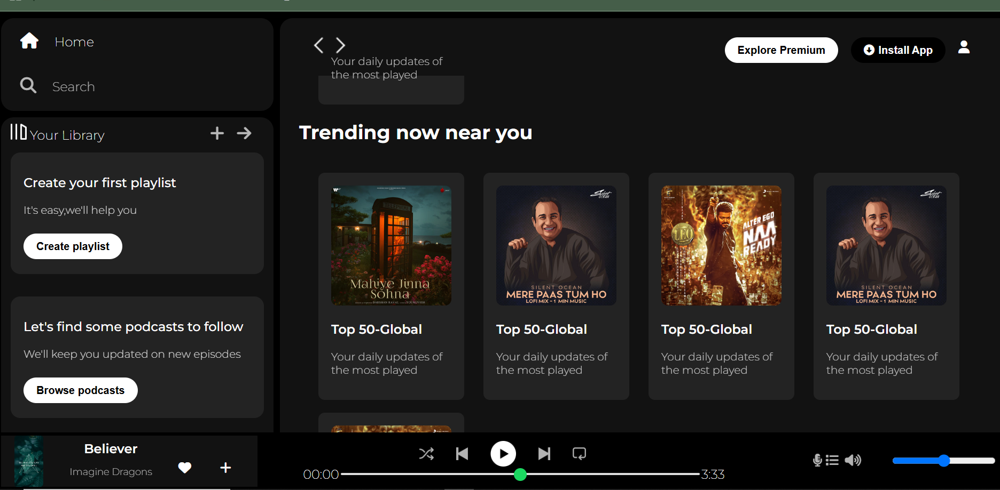
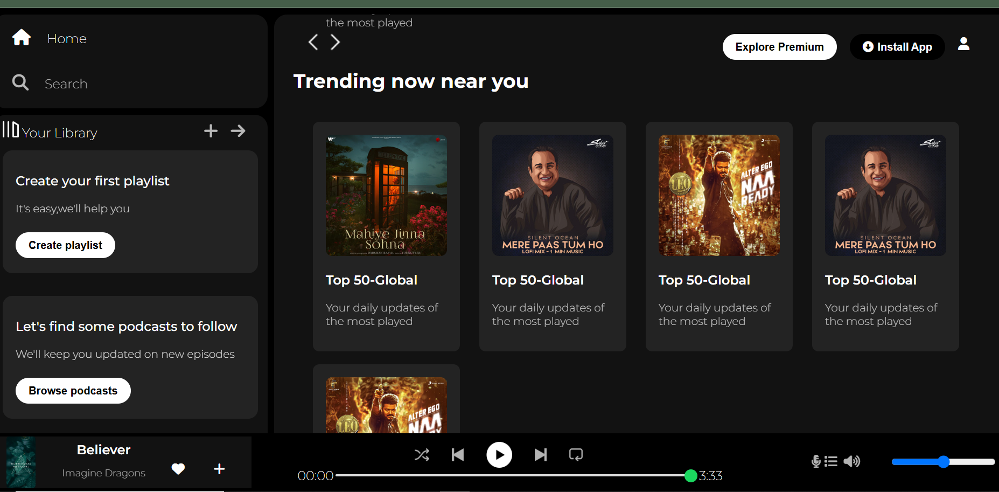
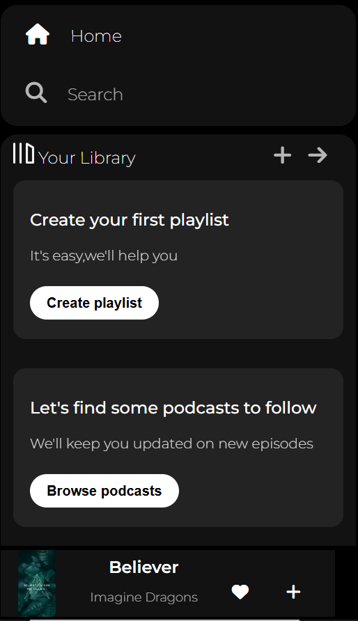
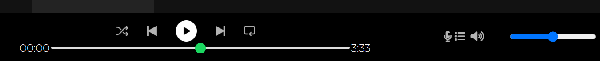

🎵 Spotify Clone
A simple front-end clone of the Spotify Web Player, built using HTML and CSS. This project replicates the layout and basic styling of Spotify’s interface, including a sidebar, music cards, a sticky navigation bar, and a fixed bottom music player.

📸 Preview

🚀 Features
🎧 Responsive sidebar with navigation and library options

🃏 Card-based layout for playlists and albums

📌 Sticky navigation bar for quick actions

🎶 Static music player at the bottom

💅 Clean, Spotify-inspired UI using Font Awesome and Google Fonts

💡 Fully responsive design for desktop view

🛠️ Built With
HTML5

CSS3

Font Awesome

Google Fonts - Montserrat

📂 Folder Structure
bash
Copy
Edit
.
├── index.html
├── style.css
├── assets/
│   ├── logo.png
│   ├── card1img.jpeg
│   ├── card2img.jpeg
│   ├── player_icon1.png
│   └── ...other images/icons
📸 Screenshots

The main page with cards

The sticky navbar

The bottom music player

⚠️ Disclaimer
This is a static front-end clone and does not include real music streaming or authentication. It is intended for educational and practice purposes only and is not affiliated with Spotify.

📬 Connect With Me
GitHub: YourGitHubUsername

LinkedIn: YourLinkedIn

📝 License
This project is open-source and available under the MIT License.

